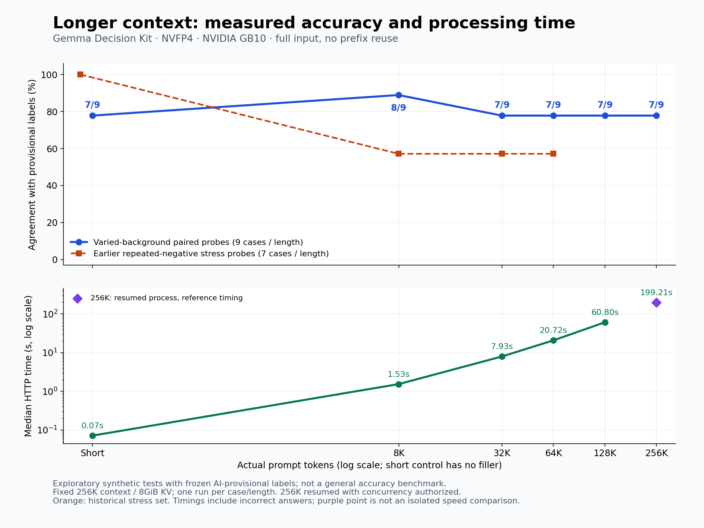

> v0.6.0ではEider本体の質問処理・結果処理と最適化vLLMを接続しています。新方式は `--semantics eider` で明示指定します。映像＋音声の比較で誤答が増えたため、既定は旧方式の `legacy` を維持しています。最初に[ネイティブブリッジをビルド](docs/EIDER.md)してください。過去の測定表は当時の構成の記録で、新しい接続方式の測定値ではありません。

[今回の統合検証と既知の映像＋音声の誤答](docs/EIDER_RELEASE_VALIDATION.md)：テキスト61/64で直前版と回答・確率一致、合成画像9/9・短い合成動画3/3。映像と発言を組み合わせる判断には誤答が残り、実験的な対応です。

[Spark／GB10搭載OEM向け最適化と標準GPU設定](docs/HARDWARE.md)を分離しました（`--hardware auto|spark|standard`）。GB10以外のGPUでの実機動作は未検証です。

# Gemma Decision Kit

**テキスト・画像・短い動画・音声を扱う、Eider＋最適化vLLMによるNVFP4版Gemma 4のローカル判定キット**です。choice（2〜64択）、noul（真の確率）、score（順序付き基準の期待値）に対応します。確率は未校正です。音声はMOSSで文字起こし・話者分離・発話時刻の取得を行い、そのテキストをGemmaへ渡します。文字起こし単体でも利用できます。

| 入力 | 処理内容 | 使い方 |
|---|---|---|
| テキスト | 本文をGemmaで型付き判定 | `predict` / HTTP |
| 画像 | PNG/JPEG 1枚の視覚情報を判定 | `--media`＋画像JSON / HTTP |
| 動画 | 最大10秒のMP4 1本からフレームを抽出して判定 | `--media`＋動画JSON / HTTP |
| 音声・動画の音声トラック | 最大30分の音声をMOSSで文字起こしし、必要に応じてGemmaで判定 | `transcribe` / `predict --audio`（従来経路はCLI・Pythonのみ。共通HTTPは`serve-input`） |

音声機能のコードはv0.4.0に同梱しています。MOSS重み・音声用依存環境・FFmpegは別途セットアップが必要です。**v0.5.0では短い音声付き動画の実機処理を確認しました。任意の質問の区間集約には誤答があり、存在・全称条件は明示した`any`/`all`で集約できます。** [導入手順](docs/AUDIO.md)・[検証状況](docs/UNIFIED_VALIDATION.md)。従来の`predict`では映像と音声を別々に指定します。v0.5.0の`analyze --source`は両方を自動処理します。

## 仕組みを理解する

[図で理解する Eider・vLLM・Gemma](docs/EIDER_VLLM_GUIDE.ja.md) — モデルと推論エンジンの違い、Eiderの内部構造、v0.5.0時点の構成、音声・動画の処理を7点の図で説明します。現在のEider接続は[EIDER.md](docs/EIDER.md)を参照してください。[オフライン閲覧用HTML](docs/EIDER_VLLM_GUIDE.ja.html)はダウンロードしてブラウザーで開けます。

## 入力の自動処理（v0.5.0）

`analyze --source ファイル`でテキスト・画像・音声・動画を判別します。音声付き動画ではMOSSの発話と映像を元の時刻で対応付け、10秒以内の区間を順にGemmaへ渡します。利用者による`--media`/`--audio`の選択は不要です。長い動画の最終判定は各区間の暫定3択結果を集約する方式で、全映像の一括理解や一瞬の出来事の検出を保証しません。

```sh
gemma-decision analyze --model-path /models/nvfp4 \
  --source /input/recording.mp4 --input examples/request.json \
  --audio-model-path /models/moss --audio-python /state/moss-env/bin/python \
  --output /state/analysis.json
```

音声重み・依存環境は別途セットアップが必要です。処理範囲・未処理区間・発話時刻・区間ごとの判定を出力します。`serve-input`の`/v1/analyze`は小さいファイルのインライン送信に対応し、大きい録画はCLIで処理します。[使用方法と制限](docs/UNIFIED_INPUT.md)・[検証状況](docs/UNIFIED_VALIDATION.md)。従来の`predict`/`serve`も引き続き利用できます。

## 過去の構成で測定した日本語判定の精度と速度

**GB10で一致率93.3%（112/120）、短文1問はwarm中央値約80ms。** 下記6構成の比較では最も高い一致率でした。同一機でHTTP計測したDiffusionGemmaとの比較では、短文1問は**1.62倍高速**、v1一致率は**5.0ポイント高い**結果です。

### 検証ハードウェア

| 項目 | 実測環境 |
|---|---|
| マシン・GPU | Edge Xpert、NVIDIA GB10（Blackwell・SM121）を1基使用 |
| メモリ | CPU/GPU共有の統合メモリ。OS認識約121.6GiB。**モデル専用VRAMの容量ではありません** |
| 実行環境 | Linux ARM64。本キットはPyTorch2.11.0+cu130。各構成のランタイムを固定 |
| A試験のCPU使用上限 | コンテナ8CPU相当、`OMP_NUM_THREADS=4` |

より強力なGPUでは、特に長文のprefillを高速化できる可能性があります。ただし他GPUは未測定で、**「数倍速くなる」という倍率は未検証**です。CPU前処理・メモリ帯域・対応カーネルにも左右されるため、公称TOPS等の比率をそのまま速度に掛けることはできません。配布手順のARM64/GB10用イメージは、x86/RTX環境でそのまま動作確認したものではありません。

### モデルのメモリ使用量

| NVFP4の構成 | GPUテンソル使用量のピーク | allocator予約領域のピーク |
|---|---:|---:|
| テキスト高速構成 |21.99GiB|23.91GiB|
| 画像・動画対応（`--media`） |23.11GiB|24.10GiB|

v0.2.0のGB10実機試験での値です。画像・動画側は起動時のプロファイルも含みます。予約領域は使用中の領域を含むため、**2列を足しません**。ドライバー・CPU側メモリをすべて含む値でも、最小必要VRAMの保証でもありません。GB10ではCPU/GPUがメモリを共有するため、OS・ランタイム・ロード用の余裕も必要です。**モデルに121.6GiB必要という意味ではありませんが、24GBの別GPUで動くことも未確認です。** [定義と測定根拠](docs/MEMORY_AND_LONG_INPUT.md)。

日本語の証拠から「支持・矛盾・情報不足」を判定する固定タスクです。精度欄は**AI暫定ラベルとの一致率**で、人間監査済みの正答率ではありません。品質は120ケース、速度は本文54文字の1問を20回反復した別の測定です。

| 構成 | 一致率（v1・120例） | 短文1問・中央値 | 測定 |
|---|---:|---:|---|
| Gemma Decision Kit · Gemma 4 26B-A4B NVFP4 | **93.3% (112/120)** | **80.4ms** | A |
| DiffusionGemma 26B-A4B NVFP4 | 88.3% (106/120) | 130.6ms | A |
| Eider · Qwen3.6-35B-A3B NVFP4 | 85.8% (103/120) | 250.3ms | B |
| SemIf · Qwen3.5-4B BF16 | 64.2% (77/120) | 119.6ms | B |
| Laya multilingual · 0.322B † | 39.2% (47/120) | 8.8ms | B |
| NanoJev · 0.6B navigation checkpoint | 38.3% (46/120) | 40.6ms | B |

**A:** 2026-09-23、同一GB10機でloopback HTTP計測。**B:** 2026-09-20、別のGB10機で計測。QwenはHTTP、ほかはPython APIです。モデルロード後のwarm中央値で、起動時間は除外。モデルサイズ・量子化・テンプレート・API境界が異なるため、完全同条件の速度ランキングではありません。本キットの行は固定最適化レシピを評価用HTTP経由で測定した値です。v0.2.0で判定の一致は確認済みですが、公開サーバーで常に同じレイテンシになる保証ではありません。

**† Layaの全文読込みについて：** 表の8.8msは本文54文字の短文で、**切断なし**、同じ1問の20反復は20/20一致です。一方、2,099文字・8,108文字では各5/5件で全文を保持できず、21.6ms・23.1msという速さでも各0/5一致でした。これは**長文を全文読んだ速度ではありません**。v2品質試験も100/100件で対象主張を含む指示部分が切断されています。表の品質欄に使ったv1の120例には切断がなく、39.2%という一致率を切断だけの結果とはしていません。[入力coverageの内訳](docs/MEMORY_AND_LONG_INPUT.md)。

Laya・NanoJevはこの短文ではさらに高速ですが、本タスクの一致率は低い結果でした。また8問workflowではDiffusionGemmaが優位です（377.6ms対732.8ms、一致40/40対35/40。同じ8問を5回反復）。NanoJevはnavigation向けcheckpointの結果であり、日本語汎用判定向けモデル全般の評価ではありません。

[比較条件・指示文による変化・固定版](docs/COMPARISON.md)・[集計JSON](docs/comparison-results.json)・[テキスト/画像/動画の速度と初回起動の注意](docs/BENCHMARKS.md)

### 長文の最適化前後

**研究用nativeランナーの過去の実測です。** 当時の内部上限は65,536トークンです。v0.3.0では公開APIを最大262,143入力トークンまで拡張しました。[新しいHTTP実測と長さ別の精度](docs/CONTEXT.md)は別試験であり、下表の速度と混同しないでください。

| 本文文字数 / prompt tokens | 安定化済み基準 | 最終構成 | 時間短縮 |
|---|---:|---:|---:|
|10,000 / 7,138|1.563s|1.319s|15.6%|
|30,000 / 21,197|6.569s|4.570s|30.4%|
|50,000 / 35,257|15.248s|8.686s|43.0%|

同一GB10・固定Gemma4 NVFP4重み・同じ全文入力、1質問、モデルと形状を準備済み、prefix再利用なし、各3反復の中央値。入力準備＋native推論を含み、ロード・HTTP・計装時間は除外しています。各長さ1文書の結果で、任意の長文で同じ速度を保証するものではありません。主な改善はAttentionの実行設定、MoEのバッファ・コピー削減、ABC判定用の出力投影です。

基準は**安定化済みnative CUTLASS構成**です。それ以前のFlashInfer構成との比較では、5万文字13.714秒→8.686秒（36.7%短縮）ですが、1万文字は1.242秒→1.319秒で遅くなっています。安定性・品質も異なるため、すべての旧構成・入力に対して高速化したとはしていません。[段階別結果と制約](docs/MEMORY_AND_LONG_INPUT.md)。

## 機能と使い方

- v0.2.0はNVFP4に一本化。EXL3は現行配布から外し、旧v0.1.0の履歴に保持。
- 通常起動は従来のテキスト高速構成。`--media`で画像・動画に対応する構成を起動。
- 同じNVFP4モデルを使いますが、テキスト専用と画像・動画対応ではKV設定や最適化が異なります。
- 画像はPNG/JPEGを1枚、動画はMP4を1本。`--media`の動画処理はフレームから視覚情報を判定します。音声トラックは別途`--audio`で指定します。
- choice・noul・score、複数質問の逐次処理。Gemmaによる自由文生成は行いません。音声の文字起こしはMOSSで対応。複数区間の動画ではnoul／scoreの集約を拒否します。
- 実機確認環境はEdge Xpert / GB10、Linux ARM64。別GPUでの動作や性能は未認定。

```sh
gemma-decision predict --model-path /models/nvfp4 --input examples/request.json
gemma-decision predict --media --model-path /models/nvfp4 --input examples/image-request.json
gemma-decision predict --media --model-path /models/nvfp4 --input examples/video-request.json
gemma-decision serve --media --model-path /models/nvfp4 --port 8765
# 音声用セットアップ後：音声ファイル、または動画の音声トラックを判定
gemma-decision predict --model-path /models/nvfp4 --input examples/request.json \
  --audio /input/recording.mp4 --audio-model-path /models/moss \
  --audio-python /state/moss-env/bin/python --transcript-output /state/transcript.json
```

[導入手順](docs/INSTALL.md)・[画像/動画のAPIと制限](docs/MEDIA.md)・[検証結果](docs/BENCHMARKS.md)。APIは127.0.0.1限定です。

独立した実験版であり、公式Jev・Eiderの互換品を認定するものではありません。確率は正答率の保証ではなく、テストの正解はAI暫定ラベルです。小規模合成素材での検証を一般的な精度保証に読み替えないでください。

コードと自作サンプルはApache-2.0。モデル重みは別途ダウンロードします。[ライセンス詳細](docs/LICENSES.md)。

## 長文上限と正答率（v0.3.0）

テキストは標準で**65,535入力トークン**、`--max-input-tokens 262143` の明示指定で**262,143入力トークン**まで対応します。モデル本来の256K（262,144）から判定出力1トークンを確保します。128K設定は`--max-input-tokens 131071`です。画像・動画モードは従来どおり8,192入力トークンです。1Mには対応しません。



**入力可能な長さと、正しく判定できる割合は別です。** 青線は同じ9問へ背景記録を追加した比較、橙線は前回の反復否定文7問です。どちらもAI暫定ラベルの合成問題であり、過去のモデル比較の**93.3%（112/120）とは別の数字**です。誤答を除外していません。長い文脈からの根拠の取り出し、指示・反復表現への頑健性、ラベルの独立監査を**今後の精度改善課題**とします。今回の配布は上限拡張であり、精度改善を達成したという報告ではありません。[実測値・手順・制約・データ](docs/CONTEXT.md)。

今回の9問では短文**7/9（77.8%）**、約256Kで**7/9（77.8%）**でした。小標本・暫定ラベルであり、単調な低下や一般的な正答率を保証する数字ではありません。1問はラベル解釈に余地があり、独立監査を今後実施します。64K／128K／256KのKV確保量は3／4／8GiBです。[全体の実測メモリ表](docs/CONTEXT.md#runtime-and-memory)を確認してください。


## ローカル音声認識（v0.4.0）

MOSSで文字起こし・匿名話者・発話時刻を取得し、`predict --audio`でGemma4へ渡せます。`transcribe`単体にも対応。MOSS終了後にGemmaをロードします。HTTP音声は対象外です。重みや会議素材は同梱せず、adapter・固定manifest・noticeを配布します。

[音声の導入・コマンド・制限](docs/AUDIO.md)・[実機検証の状況](docs/AUDIO-VALIDATION.md)。

## 3択以外の出力形式の比較（追加検証）

**Gemmaの行は以前の評価用アダプターの測定結果で、v0.6.0のEider統合版の測定値ではありません。** EiderモードのAPIはnoul・score・可変選択肢数に対応します。 Eider Qwen・Laya・NanoJevは各OSSの型付きAPI、SemIfは評価用変換を使用しました。DiffusionGemmaは起動時の安全条件で停止し、今回は未測定です。

固定した短文96件（26の相関するグループ）に対するAI暫定ラベル一致数です。Score列は5段階の最頻段階の一致数。汎用精度・長文精度を保証する評価ではありません。

| Configuration | Choice 2 | Choice 4 | Choice 8 | Noul / boolean | Score: top level |
|---|---:|---:|---:|---:|---:|
|Gemma4 NVFP4 · research adapter|18/20|20/20|16/16|18/20|16/20|
|Eider Qwen3.6 NVFP4|18/20|20/20|16/16|18/20|18/20|
|SemIf + Qwen3.5-4B · adapter|18/20|20/20|16/16|18/20|15/20|
|Laya multilingual|14/20|17/20|16/16|15/20|7/20|
|NanoJev root checkpoint|10/20|17/20|13/16|10/20|7/20|
|DiffusionGemma NVFP4|BLOCKED|—|—|—|—|

速度はミリ秒の中央値。単問は各型3問×5反復、Mixedは同じ文章に対する8問全体×5反復です。DiffusionGemmaはロード中の追加swap検出で2回停止し、今回は判定未実施です。GB10・同一機・逐次測定ですが、Qwen/DiffusionはHTTP、ほかはPython APIのため完全同条件のモデル単体比較ではありません。

| Configuration | Choice 2 | Choice 4 | Choice 8 | Noul / boolean | Score | Mixed 8 questions |
|---|---:|---:|---:|---:|---:|---:|
|Gemma4 NVFP4 · research adapter|59.4|60.4|63.5|60.2|61.0|518.1|
|Eider Qwen3.6 NVFP4|182.5|178.4|188.2|183.1|187.8|851.3|
|SemIf + Qwen3.5-4B · adapter|69.4|79.0|83.0|69.6|81.0|655.2|
|Laya multilingual|6.0|6.0|6.7|6.2|6.7|16.7|
|NanoJev root checkpoint|18.3|22.1|26.6|15.7|20.8|160.1|
|DiffusionGemma NVFP4|BLOCKED|—|—|—|—|—|

**形式によって精度と速度の優劣が変わります。Gemmaが全形式で最高精度という結果ではありません。** Layaの今回は入力切断0件の短文条件です。真偽確率のBrier、scoreの数値誤差、8問の正解数、数値丸めの制約、全ケースは[詳細レポート](docs/TYPED_OUTPUTS.md)に掲載しています。
