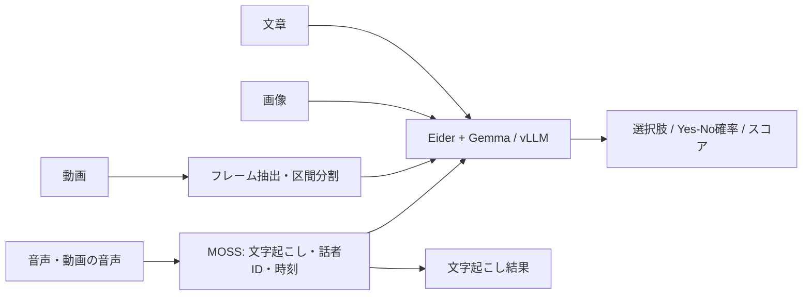

# Gemma Decision Kit

*Eider-powered decisions with optimized vLLM.* · [English](README.md)

**文章・画像・動画に質問し、選択肢・Yes/No確率・スコアで答えるローカル実行キット。音声の文字起こしと話者分離にも対応します。** Eiderが判定の形式を整え、最適化したvLLMでGemma 4 NVFP4を実行。音声認識はMOSSが担当します。

[できること](#できること) · [処理速度](#処理速度の目安) · [Jevとの比較](#jevとの比較) · [日本語OSS比較](#日本語タスクでのoss比較) · [導入](#導入と使い方)

## できること

| 入力・機能 | 得られるもの | 使い方の例 |
|---|---|---|
| テキストの判定 | 選択肢、Yes/No確率、段階スコア | 「この証拠は主張を支持するか」「どのカテゴリか」 |
| 画像の認識・判定 | 画像に対する質問への判定 | 「赤い物体があるか」「指定条件を満たすか」 |
| 動画の判定 | 抽出フレームと区間ごとの判定 | 「対象の動作が少なくとも一度あったか」 |
| 音声認識 | 日本語・多言語の文字起こし | 会議・録音の発話をテキストにする |
| 話者分離（diarization） | 匿名の話者IDと発話区間の時刻 | 「誰の発話か」を録音内で区別する |
| 音声・映像の組合せ | 文字起こしと映像を時間で合わせて判定 | 発言内容と同時刻の映像を照合する |

話者分離は**話者ごとのラベル付け**です。声を別々の音声ファイルへ分離する機能、実名の特定、顔と声の照合ではありません。話者タグが得られない場合は「不明」として返します。判定の出力は `choice`・`noul`・`score`。自由文での回答生成ではなく、プログラムから扱うための形式です。



音声付きファイルはMOSSを終了してからGemmaをロードします。動画は全フレームを読む方式ではありません。[音声の仕様](docs/AUDIO.md) · [ファイル処理の仕様](docs/UNIFIED_INPUT.md)

## 処理速度の目安

**実測機はEdge XpertのNVIDIA GB10 1基（Linux ARM64）。以下は異なる用途・版の測定です。** 「判定だけ」と「モデルのロードを含むファイル処理」を分けて読んでください。

| 用途 | 実測時間 | 何を測ったか |
|---|---:|---|
| テキスト判定 · v0.7 | **中央値84.5ms / 1問** | JevBench公開231問。p95は504.2ms。モデル常駐、同一マシン内HTTP込み |
| 画像判定 · v0.6 | **中央値148.3ms / 3問セット** | 合成画像3枚を各3問で再判定。モデル・キャッシュ準備済み、直接Python呼出し |
| 短い動画の判定 · v0.6 | **174.6ms / 3問セット** | 3秒の合成動画1本の再判定。モデル・キャッシュ準備済み、直接Python呼出し |
| 文字起こし＋話者ラベル · 開発時のMOSS | **441.51秒（約7分22秒）** | 24分56秒の会議1件 → 250発話区間・匿名2話者。ロードを除く前処理＋推論 |
| 音声ファイルから判定まで · v0.6 | **180.32秒** | 短い合成音声1件。MOSSとGemmaのコールドロード込み |

画像の148.3msは**1問の値ではなく、3問セット全体**です。画像9/9問、動画3/3問が暫定正解と一致しましたが、少数の合成素材による動作確認です。実写真の一般的な認識精度やOCR性能の保証ではありません。音声の約7分22秒も1録音の開発測定で、一般的な認識誤り率・話者誤り率は未測定です。

<details>
<summary>入力長・反復回数・キャッシュなどの測定条件</summary>

テキストはNVFP4重み／FP8 KV、入力123〜3,958トークン（中央値202）、単問逐次、231問×3回。3回の中央値は83.82〜84.49msで回答・確率は一致。初回判定1.045秒は集計に含み、モデルロード135.54秒は別計上です。画像は1セット1,086入力トークン×3セット、動画は1,623入力トークン×1セットのキャッシュ済み再実行。メディアはNVFP4重み／BF16・auto KV、MOSS会議測定はBF16・batch 1です。**起動直後・新しい画像・ファイル経由でも同じ時間になるという意味ではありません。**

</details>

[テキストの測定条件](docs/JEVBENCH.md) · [Eider画像・動画・音声の実測](docs/EIDER_RELEASE_VALIDATION.md) · [MOSS測定](docs/AUDIO.md#measurement-scope) · [旧版の画像キャッシュ比較](docs/BENCHMARKS.md)

## Jevとの比較

**公開231問では本キット205問、Jev 200問が正解。速度は本キット約84.5msですが、Jevに対する速度倍率は未確定です。**

| 同じJevBench公開231問 | 正解数 | 正答率 | 速度の扱い |
|---|---:|---:|---|
| **本キット v0.7 · Eider＋最適化vLLM＋Gemma 4 NVFP4** | **205/231** | **88.7%** | ローカルHTTP中央値84.5ms |
| Jev 1.13.0 · 公表結果 | 200/231 | 86.6% | 同一機材・通信条件で未測定 |
| djev · 公表結果 | 194/231 | 84.0% | 同上 |
| SemIf Qwen3.5-4B · 公表結果 | 187/231 | 81.0% | 同上 |

差はJevに対して**+5問・+2.16ポイント**。ただし統計的に明確な優位は確認できません。外部の行は固定版の公開結果であり、こちらで再実行した値ではありません。非公開問題を含む公式ランキングとも異なります。より高得点の生成モデルもあります。

**「Jevより8倍速い」とは言えません。** ローカル実行とクラウドAPIでは通信、サーバーの待ち時間、機材、バッチ処理などが異なります。その差を通信レイテンシーだけで説明する根拠もありません。[全比較・不確実性・測定方法](docs/JEVBENCH.md)

## 日本語タスクでのOSS比較

**固定した日本語の証拠判定120例では、本キットの過去の最適化構成が6構成中で最も高い一致率でした。** JevBenchとは別のデータです。以下は**AI暫定ラベルとの一致率**で、人間監査済みの正答率ではありません。開発時にも使った回帰用データで、独立した未知テストでもありません。


*左はJevBenchの正答率、右は日本語の暫定ラベル一致率。異なる試験なので、左右の数値同士は比較しません。数値・条件は上下の表を参照。*

| 構成 | 日本語120例の一致率 | 短文1問の中央値 | 測定 |
|---|---:|---:|---|
| **本キット · Gemma 4 26B-A4B NVFP4** | **93.3%（112/120）** | **80.4ms** | A |
| DiffusionGemma 26B-A4B NVFP4 | 88.3%（106/120） | 130.6ms | A |
| Eider · Qwen3.6-35B-A3B NVFP4 | 85.8%（103/120） | 250.3ms | B |
| SemIf · Qwen3.5-4B BF16 | 64.2%（77/120） | 119.6ms | B |
| Laya multilingual · 0.322B | 39.2%（47/120） | 8.8ms | B |
| NanoJev · 0.6B navigation checkpoint | 38.3%（46/120） | 40.6ms | B |

Aは2026-09-23の同一GB10機・HTTP、Bは2026-09-20の別GB10機（QwenはHTTP、その他はPython API）。速度はロード後、本文54文字の1問を20反復した中央値で、品質120例の平均処理時間ではありません。モデル・量子化・入力テンプレート・通信境界が異なります。本キットの行は**旧最適化レシピ（v0.2で回答の一致を確認）の実測で、v0.7の再測定ではありません**。

- **短文1問の同一機比較：** DiffusionGemma比で1.62倍の速度、ラベル一致率は+5.0ポイントでした。
- **8問まとめる用途：** DiffusionGemmaの方が速く、377.6ms対本キット732.8ms。一致も40/40対35/40（同じ8問を5反復）でした。
- **小型モデル：** Laya・NanoJevは短文では速い一方、このタスクの一致率は低めです。Layaの表内v1入力に切断はありませんが、別の長文試験は切断あり。NanoJevはnavigation向けcheckpointです。
- **指示文の影響：** SemIfは同じ40例で指示変更により57.5%→92.5%になりました。表の順位をモデルの能力上限とは扱いません。

[版・量子化・条件・入力切断の詳細](docs/COMPARISON.md) · [集計JSON](docs/comparison-results.json)

## 導入と使い方

1. [固定ランタイム・モデルを導入](docs/INSTALL.md)。重みは別途取得します。
2. [Eider CPUブリッジをビルド](docs/EIDER.md)し、`GEMMA_EIDER_LIBRARY` を設定します。
3. 音声認識・話者ラベルを使う場合は[MOSS・FFmpeg](docs/AUDIO.md)も導入します。

```sh
# テキスト・画像などの質問に判定を返す
gemma-decision predict --model-path /models/nvfp4 --input examples/eider-request.json

# 文字起こし・話者ID・時刻を取得する
gemma-decision transcribe --audio /input/meeting.wav   --audio-model-path /models/moss --audio-python /state/moss-env/bin/python

# 音声・動画ファイルを処理し、質問に判定を返す
gemma-decision analyze --model-path /models/nvfp4   --source /input/recording.mp4 --input examples/request.json   --audio-model-path /models/moss --audio-python /state/moss-env/bin/python
```

| インターフェース | 選ぶ場面 |
|---|---|
| `predict` / `serve` | JSONで質問。`serve`はGemmaを常駐。画像・短い動画は起動時に`--media` |
| `transcribe` | 文字起こし・話者ラベルだけ欲しい場合 |
| `analyze` / `serve-input` | ファイルを自動判別して判定。音声処理後にGemmaをロードし、HTTP版も毎リクエストでロード |

GPU設定は通常`auto`。GB10搭載DGX Spark／Edge Xpert等は`spark`、対応条件を満たす他GPUは`standard`です。他GPU実機は未検証。[ハードウェア条件](docs/HARDWARE.md) · [v0.7への移行](docs/MIGRATION.md)

## 利用前に知っておく制約

- **確率は未校正。** JevBenchの誤答26問中21問で確信度が0.9以上でした。高い数値だけで正解と判断しないでください。
- **映像＋音声の複合判断は未解決の失敗あり。** v0.6の曖昧な合成素材でEider 1/2、旧方式2/2。区間をまたぐ推論にも失敗があり、複数区間の`score`/`noul`は未対応です。[検証記録](docs/EIDER_RELEASE_VALIDATION.md)
- **JevBenchの終了監視gateはFAILを保持。** 全693応答の保存後に所有PID監視の警告が発生。コンテナは終了コード0、GPU処理の残留なしですが、原因は未確定です。[詳細](docs/JEVBENCH.md#execution-caveat)
- **メモリと長文。** Eiderメディア実測は約23.5GiB使用／25.4GiB予約（足し合わせません）。最小VRAM要件や24GB GPUでの動作保証ではありません。テキスト既定64K・最大256K、メディア入力8,192トークン。長文精度には課題があります。[メモリ](docs/MEMORY_AND_LONG_INPUT.md) · [長文評価](docs/CONTEXT.md)

## 詳細資料・ライセンス

[三択以外の比較](docs/TYPED_OUTPUTS.md) · [過去の研究資料](docs/history/README.md)

コードはApache-2.0。[Eider](https://github.com/rdaum/eider)の判定・チャット・API実装を未変更で取り込み、ブリッジ、メディア・通信統合、ランタイム最適化を追加しています。Eider公式の配布物ではありません。[Eiderライセンス](licenses/Eider.txt) · [帰属・追加実装](NOTICE) · [固定版の来歴](native/eider-bridge/vendor/PROVENANCE.json)。モデル・第三者ランタイムは別の利用条件で、重みは同梱しません。[ライセンス詳細](docs/LICENSES.md)
