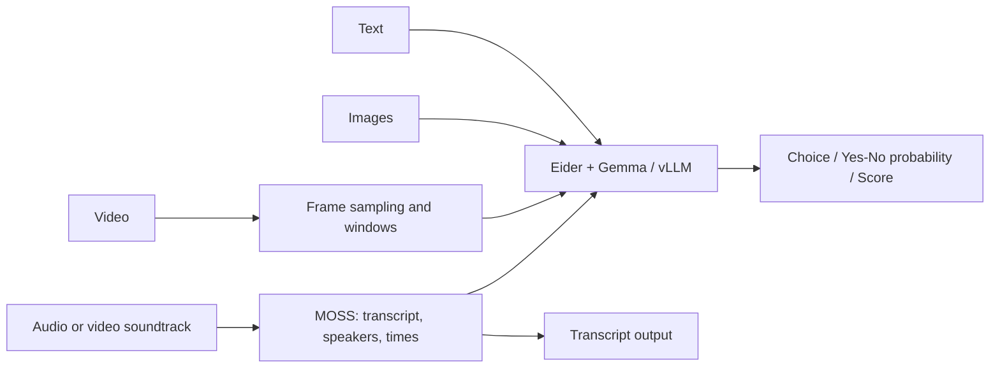
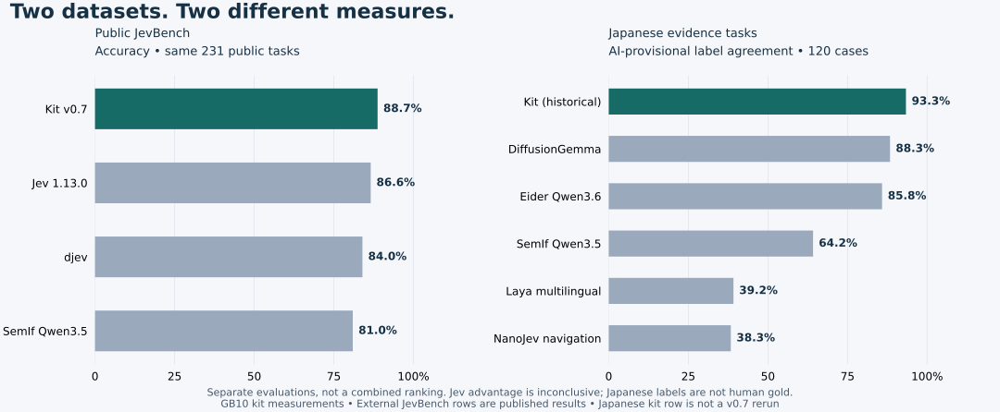

# Gemma Decision Kit

*Eider-powered decisions with optimized vLLM.* · [日本語](README.ja.md)

**Ask questions about text, images and video; get choices, yes/no probabilities or scores. Transcribe speech with speaker labels and timestamps.** Runs locally with Eider, optimized vLLM and Gemma 4 NVFP4; MOSS handles speech.

[Capabilities](#capabilities) · [Speed](#measured-processing-times) · [Jev comparison](#comparison-with-jev) · [Japanese OSS comparison](#japanese-task-comparison) · [Setup](#setup-and-usage)

## Capabilities

| Input / function | Output | Example use |
|---|---|---|
| Text decisions | Choice, yes/no probability, ordinal score | Does this evidence support a claim? |
| Image recognition and decisions | Answers to specified visual questions | Is a red object present? |
| Video decisions | Sampled-frame and interval decisions | Did a specified action occur at least once? |
| Speech recognition | Japanese / multilingual transcription | Turn a meeting recording into text |
| Speaker diarization | Anonymous speaker IDs and utterance times | Distinguish speakers within a recording |
| Combined speech and video | Decisions using time-aligned transcript and frames | Compare speech with the corresponding visuals |

Diarization **labels speakers**; it does not separate voices into audio tracks, identify people by name or match voices to faces. Missing speaker labels are reported as unknown. Decisions use the `choice`, `noul` and `score` contracts for programmatic use, rather than free-form generated answers.



MOSS exits before Gemma loads in audio/file workflows. Video analysis samples frames rather than inspecting every frame. [Audio behavior](docs/AUDIO.md) · [File processing](docs/UNIFIED_INPUT.md)

## Measured processing times

**Measured on one Edge Xpert NVIDIA GB10, Linux ARM64.** These rows cover different workflows and versions. Resident-model decisions and cold file processing have different timing boundaries.

| Workflow | Observed time | Measurement boundary |
|---|---:|---|
| Text decisions · v0.7 | **84.5ms median / question** | 231 public JevBench tasks; p95 504.2ms. Resident model, loopback HTTP included |
| Image decisions · v0.6 | **148.3ms median / three-question workflow** | Three synthetic images, three questions each, replayed with warm model/caches; direct Python |
| Short video decisions · v0.6 | **174.6ms / three-question workflow** | One replay of a three-second synthetic clip with warm model/caches; direct Python |
| Transcription + speaker labels · development MOSS | **441.51s (7m22s)** | One 24m56s meeting → 250 utterance spans, two anonymous speakers; preprocessing/inference, loading excluded |
| Audio file → decision · v0.6 | **180.32s** | One short synthetic speech fixture, including cold MOSS and Gemma loading |

The image number is for **all three questions, not one question**. Image 9/9 and video 3/3 judgments matched provisional labels; these are small synthetic integration checks, not general real-photo or OCR accuracy benchmarks. The meeting is one development measurement, with no formal recognition error rate or diarization error rate established.

<details>
<summary>Input lengths, repetitions and cache conditions</summary>

Text uses NVFP4 weights / FP8 KV, 123–3,958 input tokens (median 202), sequential single-question requests, 231 tasks × three passes. Medians were 83.82–84.49ms; answers and probabilities matched across passes. The first request (1.045s) is included; loading (135.54s) is separate. Image replay: 1,086 total input tokens per workflow, three workflows; video replay: 1,623 tokens, one workflow. Media uses NVFP4 / BF16-auto KV; meeting ASR uses BF16, batch 1. **Startup, unseen media and file-based processing can take longer.**

</details>

[Text methodology](docs/JEVBENCH.md) · [Eider media measurements](docs/EIDER_RELEASE_VALIDATION.md) · [MOSS measurement](docs/AUDIO.md#measurement-scope) · [Earlier media cache comparison](docs/BENCHMARKS.md)

## Comparison with Jev

**On the same 231 public tasks: 205 correct for this kit, 200 for Jev. This kit's median is 84.5ms; a speedup factor versus Jev has not been established.**

| Same JevBench public tasks | Correct | Accuracy | Timing comparison |
|---|---:|---:|---|
| **Kit v0.7 · Eider + optimized vLLM + Gemma 4 NVFP4** | **205/231** | **88.7%** | Local HTTP median 84.5ms |
| Jev 1.13.0 · published result | 200/231 | 86.6% | No matched hardware/network measurement |
| djev · published result | 194/231 | 84.0% | Same limitation |
| SemIf Qwen3.5-4B · published result | 187/231 | 81.0% | Same limitation |

The difference versus Jev is **five answers / +2.16 percentage points**, but a statistically clear advantage is not established. External rows are pinned published results, not our reruns. This is not the official sealed-set ranking; some generative models scored higher.

**This does not establish “8× faster than Jev.”** Local inference and cloud API timings differ in networking, queueing, hardware and batching. We also cannot attribute the difference solely to network latency. [Full comparison, uncertainty and method](docs/JEVBENCH.md)

## Japanese task comparison

**The historical optimized kit configuration had the highest agreement among six tested configurations on 120 fixed Japanese evidence tasks.** This is separate from JevBench. Scores measure **agreement with AI-provisional labels**, not human-certified accuracy. The corpus was also used during development, so it is regression evidence rather than an independent unseen test.



*Left: JevBench accuracy. Right: Japanese provisional-label agreement. Different datasets; do not compare percentages across panels. Tables provide the figures and conditions.*

| Configuration | Japanese agreement /120 | Short-question median | Study |
|---|---:|---:|---|
| **Kit · Gemma 4 26B-A4B NVFP4** | **93.3% (112/120)** | **80.4ms** | A |
| DiffusionGemma 26B-A4B NVFP4 | 88.3% (106/120) | 130.6ms | A |
| Eider · Qwen3.6-35B-A3B NVFP4 | 85.8% (103/120) | 250.3ms | B |
| SemIf · Qwen3.5-4B BF16 | 64.2% (77/120) | 119.6ms | B |
| Laya multilingual · 0.322B | 39.2% (47/120) | 8.8ms | B |
| NanoJev · 0.6B navigation checkpoint | 38.3% (46/120) | 40.6ms | B |

A: same GB10 node, 2026-09-23, HTTP. B: another GB10 node, 2026-09-20; Qwen HTTP, others Python API. Timings are loaded/warm medians of one 54-character state repeated 20 times, not average latency across the quality corpus. Models, precision, prompts and API boundaries differ. The kit row is the **historical optimized recipe, with prediction parity checked in v0.2, not a v0.7 remeasurement**.

- **Same-node short question:** 1.62× faster than DiffusionGemma, with +5.0 percentage points of label agreement.
- **Eight-question workflow:** DiffusionGemma wins: 377.6ms versus kit 732.8ms; agreement 40/40 versus 35/40 across five repeats of the same eight questions.
- **Small models:** Laya and NanoJev are faster on the short probe, with lower task agreement. Laya's tabled v1 inputs were not truncated; separate long-input probes were. NanoJev uses a navigation-oriented checkpoint.
- **Instruction sensitivity:** SemIf improved from 57.5% to 92.5% on the same 40 cases after an instruction change. The table is not a capability ceiling.

[Versions, precision, conditions and truncation details](docs/COMPARISON.md) · [Aggregate JSON](docs/comparison-results.json)

## Setup and usage

1. [Install the pinned runtime and model](docs/INSTALL.md); weights are downloaded separately.
2. [Build the Eider CPU bridge](docs/EIDER.md) and set `GEMMA_EIDER_LIBRARY`.
3. For transcription and speaker labels, [install MOSS and FFmpeg](docs/AUDIO.md).

```sh
# Make a typed decision.
gemma-decision predict --model-path /models/nvfp4 --input examples/eider-request.json

# Get transcript, speaker IDs and utterance times.
gemma-decision transcribe --audio /input/meeting.wav \
  --audio-model-path /models/moss --audio-python /state/moss-env/bin/python

# Process an audio/video file and answer the supplied questions.
gemma-decision analyze --model-path /models/nvfp4 \
  --source /input/recording.mp4 --input examples/request.json \
  --audio-model-path /models/moss --audio-python /state/moss-env/bin/python
```

| Interface | When to use it |
|---|---|
| `predict` / `serve` | JSON decisions; `serve` keeps Gemma resident. Add `--media` at startup for images / short videos |
| `transcribe` | Transcript and speaker labels without decisions |
| `analyze` / `serve-input` | Automatic file routing; Gemma loads after audio processing. HTTP workers reload per request |

Hardware defaults to `auto`: `spark` for GB10 DGX Spark / Edge Xpert machines, `standard` for other GPUs meeting capability checks. Other physical GPUs are unverified. [Hardware requirements](docs/HARDWARE.md) · [Breaking changes in v0.7](docs/MIGRATION.md)

## Limits to know

- **Probabilities are uncalibrated.** On JevBench, 21 of 26 wrong answers had confidence ≥0.9. High confidence alone does not establish correctness.
- **Combined audio/video has unresolved failures.** An ambiguous v0.6 synthetic fixture scored Eider 1/2 versus legacy 2/2. Cross-window reasoning also has known failures; multi-window `score`/`noul` is unsupported. [Validation](docs/EIDER_RELEASE_VALIDATION.md)
- **JevBench's shutdown-monitor gate remains FAIL.** An owned-PID warning followed all 693 saved responses. The container exited with code 0 and no GPU work remained; the cause is unverified. [Details](docs/JEVBENCH.md#execution-caveat)
- **Memory and context:** Eider media measured about 23.5GiB allocated / 25.4GiB reserved; do not add these. This is not minimum VRAM certification or proof of 24GB GPU compatibility. Text defaults to 64K context, max 256K; media input is limited to 8,192 tokens. Long-input accuracy remains a limitation. [Memory](docs/MEMORY_AND_LONG_INPUT.md) · [Context evaluation](docs/CONTEXT.md)

## Further evidence and licensing

[Typed-output comparison](docs/TYPED_OUTPUTS.md) · [Historical research](docs/history/README.md)

Code is Apache-2.0. This kit incorporates unmodified [Eider](https://github.com/rdaum/eider) decision, chat and API source; project additions include the bridge, media/transport integration and runtime optimizations. This is an independent project, not an official Eider distribution. [Eider license](licenses/Eider.txt) · [Attribution and additions](NOTICE) · [Pinned provenance](native/eider-bridge/vendor/PROVENANCE.json). Model weights and third-party runtimes have separate terms; weights are not bundled. [License details](docs/LICENSES.md)
