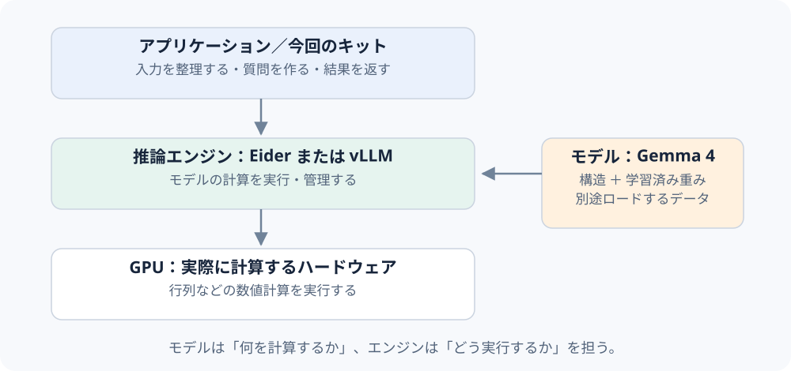
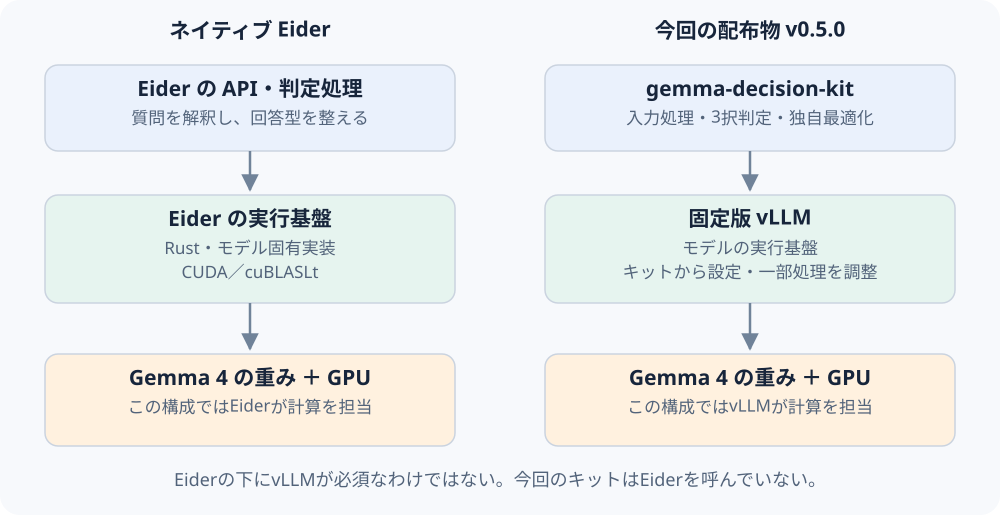
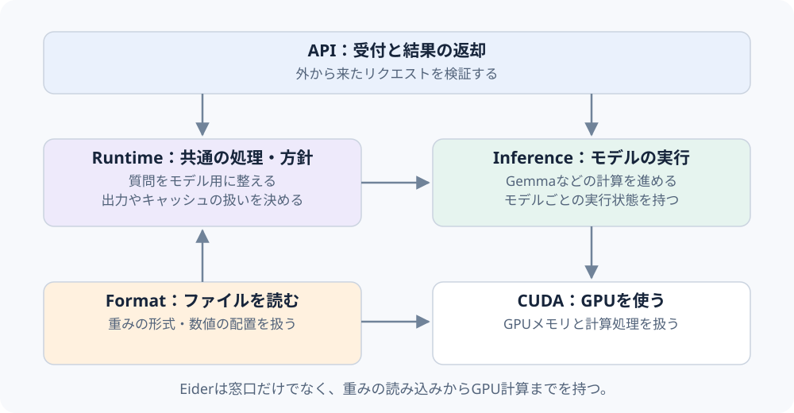
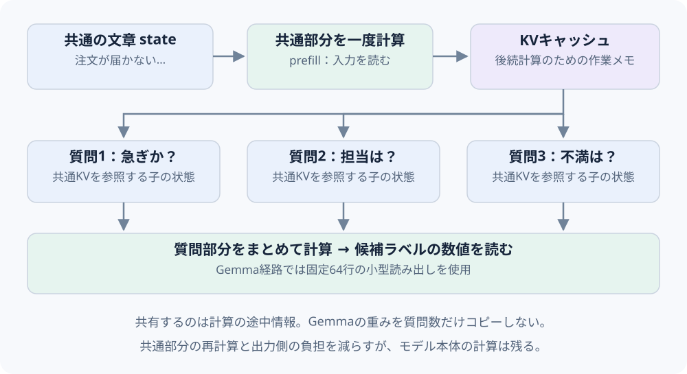
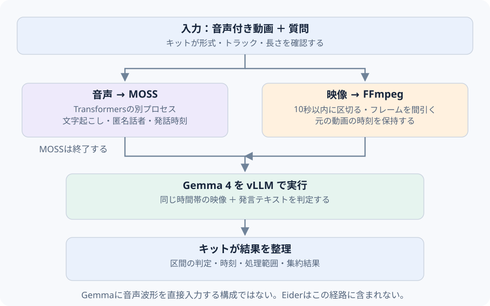
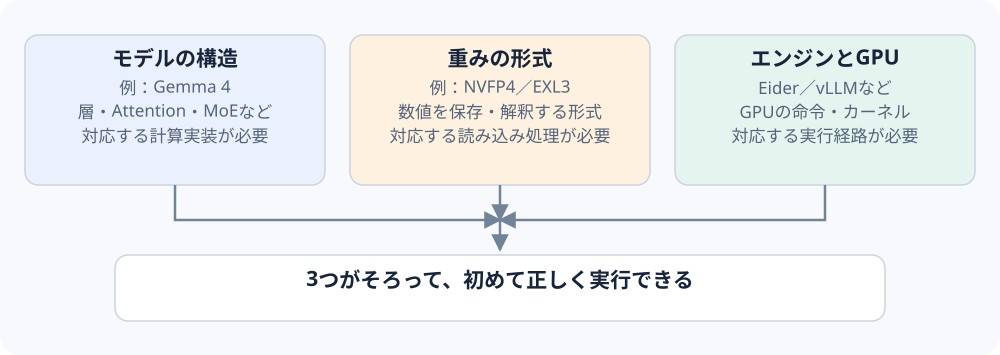

# 図で理解する Eider・vLLM・Gemma

**モデルを動かす仕組みと、私たちが作った部分を、順番に理解するためのガイド。**

「EiderもvLLMも推論エンジンなら、何が違うのか」「Gemmaはどこにあるのか」「今回の音声機能はどこに実装されたのか」という疑問に答えます。GPUや機械学習の実装経験は前提にしません。

確認日：2026-09-24。今回の配布物は **gemma-decision-kit v0.5.0／`b9db39b`** を基準にしています。上流Eiderは **`47e0c0d`** の公開コードを確認しました。別セッションの移行案や研究用アダプターを、配布済み機能と混同しません。図は説明用に簡略化したもので、速度やメモリ量の実測図ではありません。

## 1. 最初に分けたい、4つの役割

**Gemmaは学習済みモデル、EiderとvLLMはモデルを実行するソフトウェア、今回のキットは入力処理と判定を使いやすくまとめたパッケージです。**

| 名前 | 何を担当するか | それだけでは決まらないこと |
|---|---|---|
| Gemma 4 | 学習済みの数値と、計算の構造。質問に対してどの答えを出しやすいかの土台 | 起動方法、HTTPの入口、動画の区間分割 |
| Eider | 対応モデルの読み込み、GPU計算、リクエスト処理、型付き判定など | 任意のモデル・量子化形式を必ず動かせるわけではない |
| vLLM | 対応モデルの実行、処理順の管理、途中計算の保存、API提供など | 今回の会議動画の分割・MOSS連携が標準で付くわけではない |
| gemma-decision-kit | 入力の自動判別、音声・映像の前処理、質問の組み立て、判定結果の整理 | モデルを新しく学習したものではない |

「モデルをロードする」は、重みファイルを読み、エンジンが計算に使える形でメモリへ準備することです。**エンジンのプログラムと、学習済みの重みファイルは別物**です。Eiderにもモデルを計算する実装がありますが、そこに唯一のGemma重みが固定で埋め込まれている、という意味ではありません。

参考：[Eiderの概要](https://github.com/rdaum/eider/blob/47e0c0d370be2dfd74d403844c618189963089dc/README.md)、[vLLMの構成](https://docs.vllm.ai/en/latest/design/arch_overview/)。

## 2. EiderとvLLMは、どこが重なるのか

**どちらもモデルを動かす役割を持ちます。Eiderが必ずvLLMの上に載る、という関係ではありません。** Eiderは独自の実行基盤を持ち、確認した実装はRust・CUDA・cuBLASLtを使います。PyTorchやvLLMを土台にしていません。

| 比較する点 | Eider | vLLM | 今回のキット |
|---|---|---|---|
| 主な位置付け | DGX Spark／GB10を重点対象にした独立した推論サーバー | 複数モデル・構成を扱う推論・提供基盤 | vLLMを使う判定アプリケーションと最適化コード |
| 入り口 | ネイティブの判定APIなど | Pythonの`LLM`クラス、`vllm serve`など | `predict`、`analyze`、独自のHTTP入口 |
| 型付き判定 | noul／choice／scoreの実装を持つ | 必要な候補のスコア取得などを組み合わせてアプリ側で構成できる | 公開判定は3択。研究用の多形式比較とは別 |
| GPU計算 | モデル固有のネイティブ実装とCUDA処理 | モデル実装、実行管理、GPUワーカー／カーネル | vLLM経由。既存の最適化を読み込み時に適用 |
| 文章生成 | 対応モデルではチャット／生成経路も持つ | 生成経路を持つ | 現行の公開判定APIは自由文回答を生成しない |

「Eiderは判定専用で、vLLMは文章生成しかできない」と覚えると誤解します。**今回比較したいのは、それぞれをどう設定して、どの処理経路で使うか**です。ソフトウェア名だけでは精度・速度の順位は決まりません。

参考：[Eider README](https://github.com/rdaum/eider/blob/47e0c0d370be2dfd74d403844c618189963089dc/README.md)、[vLLMの入口](https://docs.vllm.ai/en/latest/design/arch_overview/#entrypoints)、[キットの実行基盤](../src/gemma_decision/backends.py)。

## 3. Eiderの中では、何が動いているのか

Eiderの「推論エンジン」という言葉は、HTTPの受付だけでなく、**モデルの読み込みからGPUの計算までを含む一式**を指します。内部は責務ごとに分かれています。

- **API**：リクエストを受け取り、形式を検証して、結果を返す窓口。
- **Runtime**：質問をモデルが読める形に整えるなど、モデル間で共通に使う処理や方針。
- **Inference**：Gemmaなど各モデルの計算を進め、実行中の状態を持つ部分。
- **CUDA**：GPUメモリや、GPU上の個々の計算を扱う部分。
- **Format**：重みファイルの形式や数値の並び方を読み取る部分。

ここでのRuntimeはEider内部のパッケージ名です。vLLM全体と一対一で置き換えられる箱という意味ではありません。図は役割の地図であり、実際の依存関係をすべて直列化したものでもありません。

参考：[Eider architecture](https://github.com/rdaum/eider/blob/47e0c0d370be2dfd74d403844c618189963089dc/docs/architecture.md)。

## 4. 「文章を書く」と「選択肢を判定する」は違う

例えば、次の文章を一度読み、3つの質問をしたいとします。

> 注文した部品が届いていません。明日の作業で必要なので、今日中に状況を知らせてください。

文章で回答するAIなら、「状況を確認してご案内します……」と続きを何トークンも生成します。型付き判定では、先に答え方を定めます。

- **noul**：「急ぎの依頼か」のような真偽の問い。返すのはtrue側の確率で、常に単なる`true/false`ではありません。
- **choice**：「物流・請求・技術のどこが担当か」。選ばれた項目と、各項目の確率を返します。
- **score**：「落ち着いている・困っている・強く不満」のように順序を付けた段階。段階番号の期待値を返すため、整数とは限りません。

scoreを0・1・2の3段階とし、確率が0.2・0.5・0.3なら、値は **0×0.2＋1×0.5＋2×0.3＝1.1** です。文章で理由を説明した点数でも、3段階目を選んだという意味でもありません。

参考：[Eiderの回答型](https://github.com/rdaum/eider/blob/47e0c0d370be2dfd74d403844c618189963089dc/crates/eider-api/src/decisions.rs)、[結果への変換処理](https://github.com/rdaum/eider/blob/47e0c0d370be2dfd74d403844c618189963089dc/crates/eider-runtime/src/decision.rs)。

## 5. Eiderが複数の質問を効率よく扱う仕組み

以下は、確認した**Gemma 4のネイティブ判定経路**です。他モデルの内部処理まで、すべて同じとは限りません。

まず、共通の文章`state`と質問ごとの部分を分けます。文章をモデルで計算する段階を**prefill**と呼びます。計算した途中の情報のうち、後続の処理で参照するものを**KVキャッシュ**に保持します。これは「正解を覚えたデータベース」ではなく、同じ前半を再計算するのを減らすための作業メモです。

Gemma経路では、その共通部分を参照する子の状態を質問ごとに作り、質問側の計算をまとめて進めます。**質問が3つあっても、モデルの重みを3組ロードするわけではありません。** 分岐用の状態や質問部分の計算・メモリは別途必要です。

最後に、答えの候補ラベルに対応する数値を読み出します。Eiderのこの経路は固定64行の小さな読み出し部分を持ちます。巨大な語彙全体の出力計算を毎回行う負担を減らせますが、**モデル本体の計算が不要になるわけではありません**。また64行とは出力側の話で、「64個の数値だけでできたモデル」という意味ではありません。

参考：[入力の分割・ラベルの準備](https://github.com/rdaum/eider/blob/47e0c0d370be2dfd74d403844c618189963089dc/crates/eider-runtime/src/decision.rs)、[KVを共有する分岐](https://github.com/rdaum/eider/blob/47e0c0d370be2dfd74d403844c618189963089dc/crates/infer/src/gemma4/sequence.rs)、[64行の読み出し](https://github.com/rdaum/eider/blob/47e0c0d370be2dfd74d403844c618189963089dc/crates/infer/src/gemma4/batch.rs)、[Gemmaの実行管理](https://github.com/rdaum/eider/blob/47e0c0d370be2dfd74d403844c618189963089dc/crates/infer/src/execution/gemma4_serving.rs)。

## 6. vLLMにも、同じ工夫はあるのか

vLLMにも、同じ入力の先頭部分の計算を再利用する**prefix caching**があります。そのため、「Eiderだけが共通部分を再利用できる」という説明は正確ではありません。一方、キャッシュがあるだけでEiderの質問分岐・バッチ処理・型付き回答まで同じ動きになるわけでもありません。[vLLMのprefix caching](https://docs.vllm.ai/en/latest/features/automatic_prefix_caching/)。

今回のキットは、質問を順番に処理します。v0.5.0のテキスト高速構成ではprefix cachingを無効にし、画像・動画構成では有効にしています。Eiderのネイティブ質問分岐を、そのまま実装したものではありません。テキスト経路にはA/B/Cの候補だけを小さく計算する独自最適化がありますが、画像・動画経路には同じ小型出力処理を適用していません。[設定](../src/gemma_decision/backends.py)・[逐次判定](../src/gemma_decision/core.py)・[小型出力処理](../src/gemma_decision/nv_head.py)。

### 出力の確率は、正答率ではない

例えば「物流70%」は、入力と選択肢を与えたときの候補間の分布です。「同じような案件を100件処理すれば必ず70件正しい」という保証ではありません。校正は、その確率と実際の正誤の関係を評価データで調整・確認する工程です。Eiderには校正情報を扱う仕組みがありますが、適切なデータと対象条件の確認が必要です。今回のキットのモデル確率は未校正です。`any/all`の論理集約には、確率を捏造せず`null`を返します。[Eiderの校正データ型](https://github.com/rdaum/eider/blob/47e0c0d370be2dfd74d403844c618189963089dc/crates/eider-api/src/decisions.rs)・[今回の集約](../src/gemma_decision/inputs/aggregation.py)。

## 7. 今回、独自実装したのはどこか

今回のキットには、**使い方をまとめる処理**と、**既存のvLLMの動作を調整する処理**の両方が含まれます。

| 場所 | 今回のコードでの担当 |
|---|---|
| `inputs/`・`audio/` | ファイルの判別、音声認識、動画分割、時刻対応、処理範囲、区間集約 |
| `core.py`・`cli.py` | 質問の検証・組み立て、判定結果、CLIの入口 |
| `backends.py` | 固定版vLLMの呼び出し、テキスト／映像モードの設定 |
| `nv_head.py`・`nv_scale.py`・`nv_runtime.py` | 読み込み時の出力処理・数値処理・実行処理の最適化 |

以前の「vLLM本体に今回の音声処理を追加していない」という説明は、音声・動画の自動処理を**キット側に置いた**という意味です。既存の高速化コードには、起動時にvLLM内の処理を差し替える箇所があります。「完全に無変更のvLLMを呼んでいるだけ」と理解すると、その部分を見落とします。

一方で、vLLMを一から書き直したり、今回の機能をvLLM公式へ取り込んだりしたわけではありません。対応する固定版を使う必要があるのも、こうした内部処理との結び付きがあるためです。現行の固定版は`0.26.1.dev0+gf2654939e.d20260726`です。

参考：[バックエンド](../src/gemma_decision/backends.py)、[出力の差し替え](../src/gemma_decision/nv_head.py)、[数値処理](../src/gemma_decision/nv_scale.py)、[実行設定](../src/gemma_decision/nv_runtime.py)。

## 8. 音声付き動画を渡すと、誰が何をするのか

`analyze --source recording.mp4`を呼ぶと、キットが内容を確認します。音声はFFmpegで取り出し、MOSSが文字起こし・話者ラベル・発話時刻を返します。MOSSは別プロセスのTransformersで実行し、終了後にGemmaをロードします。Gemmaへ渡る音声由来の情報は**テキストと時刻**であり、元の音声波形ではありません。

映像は最大10秒の区間に分け、重なる発言と組み合わせます。GemmaはvLLM経由で、抽出した映像と発言を判定します。現行実装は固定区間とフレームの間引きを使い、場面の変化を自動で理解して最適な区切りを決める仕組みではありません。

区間の結果は`any`（一度でも成立）・`all`（全区間で成立）を質問側で明示すれば論理的に集約できます。指定しない場合のモデルによる再集約は実験的で、合成問題で誤答を確認しています。**音声の感情理解、話者と顔の同定、映像の一瞬の出来事の漏れない検出まで実装したものではありません。**

実機では短い音声付き動画のHTTP処理と従来のMOSS→Gemma処理を確認済みです。約25分の会議は全150区間の映像前処理まで確認し、全区間のGemma判定はこの版の検証では未実施です。[使い方](UNIFIED_INPUT.md)・[実測と失敗を含む検証記録](UNIFIED_VALIDATION.md)。

## 9. モデルや量子化を取り替えるだけでは済まない理由

**量子化は、重みなどの数値の持ち方を変えることです。** NVFP4やEXL3という名前は、モデルの学習内容そのものの名前とは違います。同じGemma系でも、形式に対応した読み込み処理と計算経路が必要です。小さく保存できること、GPUで速く計算できること、元の精度を保てることは別々に確認します。

またMoEの「一部のエキスパートだけを使う」は、全重みの保存場所が不要になるという意味ではありません。計算に参加する量と、配置・保持する重みの量を分けて考えます。実際の配置方法はエンジンと設定に依存します。

現行キットの配布経路はNVFP4に固定しています。EXL3ファイルをパスだけ差し替えて、そのまま動く契約ではありません。Eiderへ戻す場合も、入力形式、候補ラベル、確率の返し方、映像対応などを接続し直す必要があります。同じ重みでも、指示文、トークン化、計算精度、候補の順番が違えば結果が変わり得ます。[配布の対応範囲](../README.ja.md)・[現在のバックエンド条件](../src/gemma_decision/backends.py)。

## 10. よくある疑問

### EiderとvLLMを両方インストールしないと動かない？

今回のv0.5.0キットはEiderを推論の依存先にしていません。Gemma側は固定版vLLM、MOSS側は別のTransformers環境を使います。ネイティブEiderを使う構成なら、そのモデル計算をEider側が担当します。

### Eiderのほうが速い？ vLLMのほうが正確？

ソフトウェア名だけでは決まりません。モデル・重み・入力・質問数・実行設定・ハードウェア・初回起動を含むかどうかをそろえて測る必要があります。単問の速さと、共通文書から複数問を処理する速さも別です。このガイドの図は性能比較結果ではありません。

### Eiderへ移行したら、今回の音声対応は捨てることになる？

MOSS、映像分割、時刻対応などは再利用できる設計です。ただし、Gemmaを実行する接続先の変更と、映像を渡せるかの確認が必要です。「再利用しやすい」と「Eiderで実装・検証済み」は区別します。移行の検討は、現在の配布物の状態とは別です。

### `vllm serve`だけで、今回の自動処理が動く？

動きません。今回の入口はキットの`analyze`／`serve-input`です。vLLM自身にもAPIサーバーはありますが、このキットの音声・動画処理とは別の入口です。

### Jev・Eider・今回のキットは同じもの？

同じものではありません。「資料と型付きの質問から判定を返す」という使い方に共通点はありますが、モデル、指示文、実行コード、対応する出力型、校正の状態は別です。今回のキットを公式JevやEiderの完全互換品とはしていません。

## 用語を見直したくなったら

| 用語 | この資料での意味 |
|---|---|
| 推論 | 学習済みモデルを使い、新しい入力を処理すること |
| 重み | 学習で決まった大量の数値。実行するプログラムとは別 |
| トークン | モデルが扱う入力・出力の単位。日本語の1文字と常に一致しない |
| prefill | 入力部分を読み、後続処理に使う状態を計算する段階 |
| decode | 続きの出力を逐次計算する段階。長文生成では繰り返す |
| KVキャッシュ | 後続のAttention計算で参照する途中情報 |
| カーネル | GPUで実行する個々の計算処理 |
| logits | 確率へ変換する前の、候補ごとの数値 |
| 校正 | 出力確率と実際の正誤の関係を評価データで調整・確認すること |
| バックエンド | 上位の処理から呼び出す、実際の計算担当 |

## 出典・確認範囲

本文のリンクは、説明の根拠となる一次資料または今回のコードです。Eiderは上記コミットへ固定したリンクを使っています。vLLMの公式ドキュメントは最新ページであり、一般的な役割の説明に使用しています。今回の固定版の設定はローカルの`backends.py`で別途確認しました。Eider READMEが参照する`docs/decision-endpoint.md`は確認したチェックアウトに存在しなかったため、この資料では実際のAPI・コンパイラ・モデルのソースを根拠にしています。

図と例はこの解説用に作成しました。架空の依頼文・数値を使用しており、会議録画や文字起こしを含めていません。原図を転載したものではありません。コードへの相対リンクはMarkdown版をリポジトリ内で読む際に利用できます。単体HTML版は図を内包しているため、外部サービスへ接続せず本文と図を読めます。
